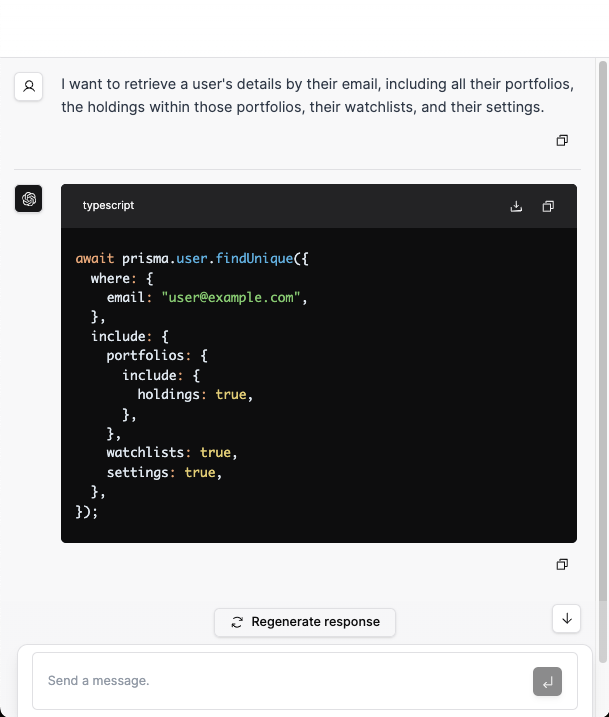

## Prisma Assistant (Alpha)

Prisma Assistant is a tool that lets you interact with your schema conversationally to gain insights and generate code, directly within your development environment.

> Note: Prisma Assistant is currently in alpha. We are actively working on improving the tool.

### Getting Started

To use Prisma Assistant, you'll need to set up your environment with an OpenAI API key, which can be obtained from [OpenAI's API portal](https://openai.com/api/):

```bash
export PRISMA_ASSISTANT_OPENAI_API_KEY=sk-...
```

Next, start the Prisma Assistant server by running the following command in your terminal:

```bash
npx prisma-assistant@latest
```

Once the server is running, Prisma Assistant will provide you with a URL to access the UI in your web browser.

### Interacting with Prisma Assistant

After accessing the UI, you can begin conversing with your Prisma schema. The UI will guide you through the process of asking questions and requesting code generation for your schema, such as:

- "Show me all the models in my schema."
- "Generate a query to retrieve all users."
- "Generate a mutation to create a new user."
- "What are the relations for the User model?"
- "What is the purpose of the Connection model?"



### Run it with Ollama

You can also run Prisma Assistant with Ollama. To do so, set the following environment variables:

```bash
PRISMA_ASSISTANT_OPENAI_MODEL="llama2" # or any other model
PRISMA_ASSISTANT_OPENAI_API_KEY="ollama"
PRISMA_ASSISTANT_OPENAI_API_BASE_URL="http://localhost:11434/v1"
```

### Security Considerations

Your OpenAI API key is sensitive information, and we do not have access to it since Prisma Assistant runs entirely on your machine. We recommend that you keep your API key secure and do not share it with others.
